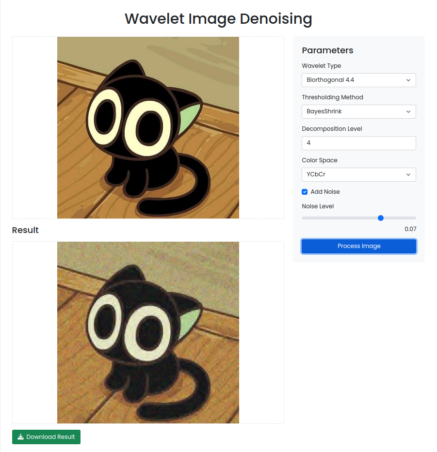
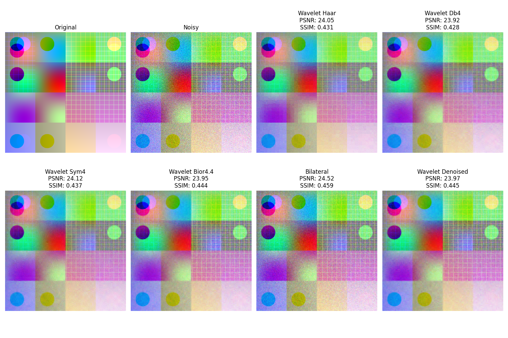

# Wavelet Transform Image Denoising

A powerful and flexible web application for image denoising using wavelet transforms, featuring multiple thresholding methods, color space processing, and comparative analysis capabilities.



## Theory

### Wavelet Transform in Image Denoising

Wavelet transforms are powerful tools for image processing, particularly in denoising applications. They work by:

1. **Decomposition**: Breaking down the image into different frequency components while preserving spatial information
2. **Thresholding**: Removing noise by modifying wavelet coefficients
3. **Reconstruction**: Rebuilding the image from the modified coefficients

This project implements three sophisticated thresholding methods:

- **VisuShrink**: Universal threshold based on image size
- **BayesShrink**: Adaptive threshold using Bayesian estimation
- **SureShrink**: Stein's Unbiased Risk Estimate for optimal threshold selection

### Color Space Processing

For color images, processing in YCbCr color space often yields better results than RGB:
- Y (Luma): Carries brightness information
- Cb, Cr (Chroma): Carry color information
- Allows for different denoising strengths for brightness and color components

## Results

### Example Denoising Results

Denoising Sample


## Installation

1. Clone the repository:
```bash
git clone https://github.com/yourusername/wavelet-transforms.git
cd wavelet-transforms
```

2. Create and activate a virtual environment:
```bash
python -m venv .venv
source .venv/bin/activate  # On Windows: .venv\Scripts\activate
```

3. Install dependencies:
```bash
pip install -r requirements.txt
```

## Usage

### Web Interface

1. Start the Flask application:
```bash
python app.py
```

2. Open your browser and navigate to `http://localhost:5000`

3. Use the interface to:
   - Upload images via drag-and-drop or file selection
   - Adjust denoising parameters
   - Compare different methods
   - Download processed images

### Parameters

- **Wavelet Type**: Choose from various wavelet families
  - `bior4.4` (Default): Biorthogonal 4.4
  - `haar`: Haar wavelet
  - `db4`: Daubechies 4
  - `sym4`: Symlets 4
  - `coif3`: Coiflets 3

- **Thresholding Method**:
  - `BayesShrink` (Default): Adaptive threshold
  - `VisuShrink`: Universal threshold
  - `SureShrink`: SURE-based threshold

- **Decomposition Level**: 1-4 (auto-selected by default)
- **Color Space**: RGB or YCbCr
- **Noise Addition**: Optional noise simulation

## Project Structure

```
wavelet-transforms/
├── app.py              # Flask application
├── transform.py        # Wavelet transform implementation
├── static/
│   ├── css/           # Stylesheets
│   └── js/            # JavaScript files
├── templates/         # HTML templates
├── uploads/          # Temporary image storage
└── output/           # Processed images
```

## Dependencies

- Python 3.9+
- NumPy
- PyWavelets
- scikit-image
- OpenCV
- Flask
- Additional requirements in `requirements.txt`

## Contributing

Contributions are welcome! Please feel free to submit a Pull Request.

## License

This project is licensed under the MIT License - see the LICENSE file for details.